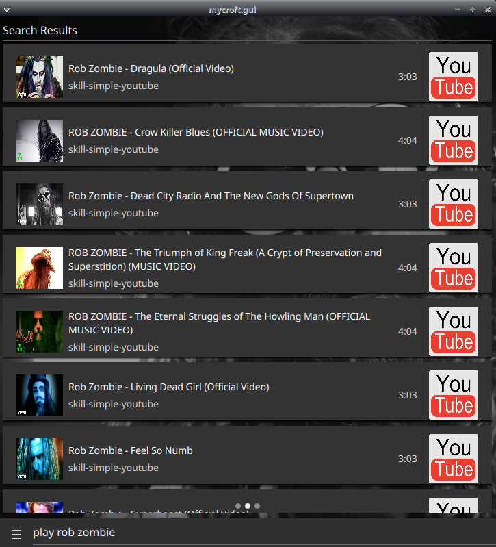
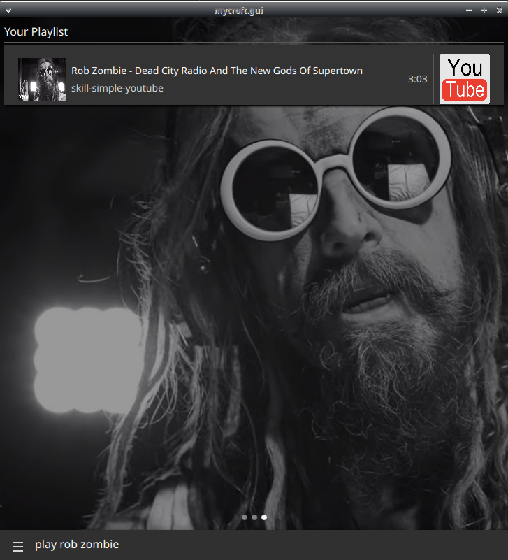

#  Simple Youtube Skill

simple youtube skill for better-cps

## About

search youtube by voice!

this skill can be configured as a fallback matcher for play queries, you can set `self.settings["fallback_mode"] = True`
and returned results will have lower confidence, other skills should take precedence most of the time

built on top of [youtube_searcher](https://github.com/HelloChatterbox/youtube_searcher)

## Examples

* "play rob zombie"
* "play freezing moon with dead on vocals"
* "play programming music mix"
* "play center of all infinity album"

## Credits

JarbasAl

## Category

**Entertainment**

## Tags

- video
- youtube
- common play
- music
